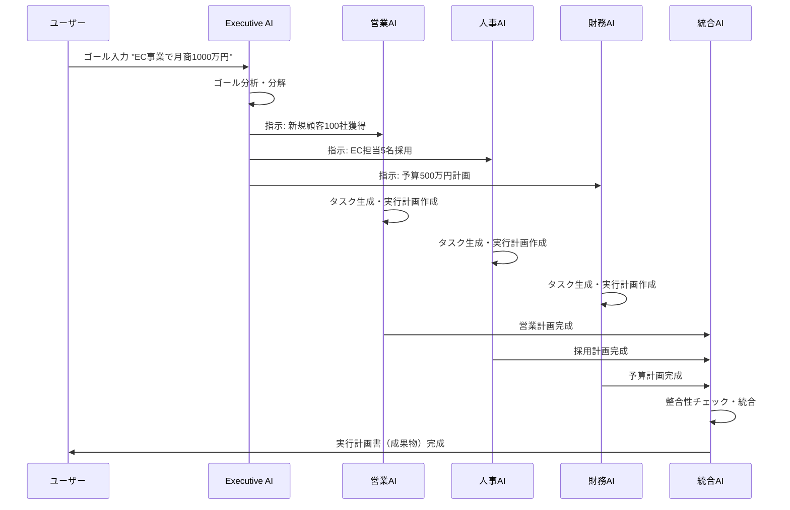

# AIエージェント連携仕様書

**作成日**: 2025年11月7日
**コンセプト**: Notionの最強版 - 内部でAIエージェントが完全に連携する独立プラットフォーム

---

## 📋 目次

1. [全体アーキテクチャ](#全体アーキテクチャ)
2. [AIエージェントの役割定義](#aiエージェントの役割定義)
3. [エージェント連携フロー](#エージェント連携フロー)
4. [データ構造](#データ構造)
5. [ユーザー操作フロー](#ユーザー操作フロー)
6. [外部ツール連携（Phase 2）](#外部ツール連携phase-2)
7. [未決定事項](#未決定事項)

---

## 全体アーキテクチャ

### コンセプト

```
Notionの最強版 = ワークスペース内で完結 + AI自動実行
```

**Phase 1（MVP）**: 内部完結型
- ✅ ユーザーがゴールを設定
- ✅ AIエージェントが自動でタスク分解・実行
- ✅ 成果物を自動生成
- ✅ 全て1つのプラットフォーム内で完結

**Phase 2**: 外部連携型
- ⏳ Slack、Teams等への通知
- ⏳ Salesforce等からデータ取得
- ⏳ 外部APIとの連携

---

## AIエージェントの役割定義

### 3層アーキテクチャ

```
┌─────────────────────────────────────┐
│      経営レイヤー（Layer 1）          │
│        Executive AI (1体)           │
│  - ゴールの理解と分解                │
│  - 戦略的判断                        │
│  - KPI設定                          │
└─────────────────────────────────────┘
              ↓ 指示
┌─────────────────────────────────────┐
│      部門レイヤー（Layer 2）          │
│    Department AIs (複数体)          │
│  - 営業AI / 人事AI / 財務AI等        │
│  - 部門特化の実行計画                │
│  - タスク生成                        │
└─────────────────────────────────────┘
              ↓ タスク実行結果
┌─────────────────────────────────────┐
│      統合レイヤー（Layer 3）          │
│      Integration Core (1体)        │
│  - 結果の統合・レポート生成           │
│  - 進捗監視                         │
│  - 成果物作成                       │
└─────────────────────────────────────┘
```

---

### 各エージェントの詳細仕様

#### 1. Executive AI（経営AI）

**役割**
- ユーザーが入力したゴールを解釈
- 何を達成すべきかを明確化
- どの部門AIに何を指示するか決定
- KPIを設定

**入力**
- ユーザーのゴール（自然言語）
- 選択された成果物タイプ

**処理**
1. ゴールの意図を理解
2. 達成に必要な要素を分解
3. 各部門への指示内容を生成
4. KPIと期限を設定

**出力**
- 部門別の指示書
- KPIリスト
- タイムライン

**例**
```
入力: "EC事業で月商1000万円達成"

処理:
- 必要な施策を分析
  - マーケティング施策
  - 営業戦略
  - 人員計画
  - 予算計画

出力:
→ 営業AI: "新規顧客100社獲得、客単価10万円目標"
→ マーケティングAI: "月間サイト訪問者10,000人達成"
→ 人事AI: "EC事業担当5名の採用"
→ 財務AI: "初期投資500万円の予算計画"
```

---

#### 2. Department AIs（部門AI）

各部門に特化したAIエージェント。部門固有の知識を持ち、実行可能なタスクに落とし込む。

##### 2-1. 営業AI (Sales AI)

**専門領域**
- 顧客獲得戦略
- 商談管理
- 売上予測
- 提案資料作成

**処理内容**
1. ターゲット顧客の分析
2. アプローチ方法の提案
3. 商談スケジュールの作成
4. 提案書・見積書の生成

**生成するタスク例**
- [ ] ターゲットリスト作成（100社）
- [ ] アプローチメール作成
- [ ] 商談資料作成
- [ ] フォローアップスケジュール設定

---

##### 2-2. 人事AI (HR AI)

**専門領域**
- 採用計画
- 人員配置
- 育成プログラム
- 評価制度

**処理内容**
1. 必要人員数の算出
2. 採用要件の明確化
3. 採用スケジュールの作成
4. 育成計画の策定

**生成するタスク例**
- [ ] 採用ペルソナ作成
- [ ] 求人票作成
- [ ] 面接スケジュール調整
- [ ] オンボーディング計画作成

---

##### 2-3. 財務AI (Finance AI)

**専門領域**
- 予算計画
- 損益予測
- キャッシュフロー管理
- 投資判断

**処理内容**
1. 必要予算の算出
2. 収益シミュレーション
3. コスト分析
4. 財務レポート作成

**生成するタスク例**
- [ ] 予算計画書作成
- [ ] 月次収支予測
- [ ] 投資回収期間の試算
- [ ] 財務報告資料作成

---

##### 2-4. マーケティングAI (Marketing AI)

**専門領域**
- 市場分析
- 施策立案
- コンテンツ作成
- 効果測定

**処理内容**
1. ターゲット市場の分析
2. マーケティング施策の提案
3. コンテンツ計画の作成
4. KPI設定と効果測定

**生成するタスク例**
- [ ] 市場調査レポート作成
- [ ] 広告キャンペーン企画
- [ ] SNSコンテンツカレンダー作成
- [ ] LP（ランディングページ）構成案作成

---

##### 2-5. 開発AI (Development AI) ※オプション

**専門領域**
- 技術選定
- 開発計画
- リソース見積もり
- 品質管理

**処理内容**
1. 技術要件の整理
2. 開発スケジュールの作成
3. 必要リソースの算出
4. 技術ドキュメント作成

**生成するタスク例**
- [ ] 技術仕様書作成
- [ ] 開発スケジュール作成
- [ ] テスト計画作成
- [ ] リリース計画作成

---

#### 3. Integration Core（統合AI）

**役割**
- 各部門AIの実行結果を統合
- 矛盾や重複をチェック
- 最終的な成果物を生成
- 進捗を監視し、問題があれば報告

**処理内容**
1. 各部門AIからの出力を収集
2. 整合性チェック（予算オーバーしていないか等）
3. 統合レポート作成
4. 成果物の最終生成

**出力する成果物**
- 📄 分析レポート
- 📄 提案書
- 📄 プレゼン資料
- 📄 実行計画書
- 📄 業務マニュアル

---

## エージェント連携フロー

### 基本フロー



---

### 詳細フロー

#### Step 1: ゴール入力

**ユーザー操作**
```
1. "新規ゴール設定"ボタンをクリック
2. AIアシスタントとチャット形式で対話
   - AI: "どのようなゴールを達成したいですか？"
   - User: "EC事業で月商1000万円達成"
3. 成果物タイプを選択
   - 選択肢: レポート、提案書、プレゼン資料、実行計画書等
   - User: "実行計画書"を選択
4. 確認
   - AI: "承知しました。8体のAIエージェントで実行します。よろしいですか？"
   - User: "はい"
```

---

#### Step 2: Executive AIによる分解

**処理内容**
```python
# Executive AIの思考プロセス（内部）

目標: "EC事業で月商1000万円達成"
成果物: "実行計画書"

# 1. ゴール分析
必要要素:
- 顧客獲得
- 商品・サービス設計
- 価格設定
- 人員体制
- 予算計画
- マーケティング戦略

# 2. 部門別指示の生成
営業AI: "新規顧客100社獲得、客単価10万円"
マーケティングAI: "月間10,000訪問者、CV率3%"
人事AI: "EC事業担当5名（営業3名、CS2名）採用"
財務AI: "初期投資500万円、月次収支計画"

# 3. KPI設定
- 月商1000万円
- 新規顧客数: 100社/月
- 客単価: 10万円
- CV率: 3%
```

---

#### Step 3: 部門AIによるタスク生成

各部門AIが並列で処理を実行。

**営業AIの処理**
```python
指示: "新規顧客100社獲得、客単価10万円"

# タスク分解
tasks = [
    {
        "title": "ターゲット企業リスト作成",
        "description": "業界・規模・地域でセグメント",
        "duration": "3日",
        "assigned_to": "営業チーム",
    },
    {
        "title": "アプローチメールテンプレート作成",
        "description": "業界別に3パターン",
        "duration": "2日",
        "assigned_to": "営業マネージャー",
    },
    {
        "title": "初回商談資料作成",
        "description": "EC事業の強み・実績・価格を訴求",
        "duration": "5日",
        "assigned_to": "営業チーム",
    },
    # ... 他のタスク
]

# 成果物生成
deliverables = [
    "ターゲット企業リスト（Excel）",
    "アプローチメールテンプレート",
    "商談資料（PowerPoint）",
]
```

**人事AIの処理**
```python
指示: "EC事業担当5名（営業3名、CS2名）採用"

# タスク分解
tasks = [
    {
        "title": "採用ペルソナ作成",
        "description": "営業・CS各ポジションの要件定義",
        "duration": "2日",
    },
    {
        "title": "求人票作成",
        "description": "魅力的な求人情報を作成",
        "duration": "3日",
    },
    {
        "title": "面接フロー設計",
        "description": "1次・2次・最終面接の評価項目設定",
        "duration": "2日",
    },
]

# 成果物生成
deliverables = [
    "採用要件定義書",
    "求人票",
    "面接評価シート",
]
```

**財務AIの処理**
```python
指示: "初期投資500万円、月次収支計画"

# 予算計画
budget_plan = {
    "初期投資": {
        "システム構築": 200万円,
        "マーケティング": 150万円,
        "人件費（採用）": 100万円,
        "その他": 50万円,
    },
    "月次コスト": {
        "人件費": 150万円,
        "広告費": 50万円,
        "システム運用": 20万円,
        "その他": 30万円,
    },
    "売上計画": {
        "1ヶ月目": 300万円,
        "2ヶ月目": 500万円,
        "3ヶ月目": 800万円,
        "4ヶ月目": 1000万円,
    }
}

# タスク生成
tasks = [
    "月次収支表作成",
    "キャッシュフロー予測",
    "投資回収期間の試算",
]
```

---

#### Step 4: Integration Coreによる統合

**処理内容**
```python
# 各部門AIの出力を収集
outputs = {
    "executive": executive_ai.output,
    "sales": sales_ai.output,
    "hr": hr_ai.output,
    "finance": finance_ai.output,
    "marketing": marketing_ai.output,
}

# 整合性チェック
def check_consistency(outputs):
    # 予算チェック
    total_cost = sum([dept.budget for dept in outputs.values()])
    if total_cost > outputs["finance"].budget_limit:
        return {
            "status": "error",
            "message": "予算オーバー。財務AIに再計算を依頼"
        }

    # 人員チェック
    required_headcount = sum([dept.headcount for dept in outputs.values()])
    if required_headcount > outputs["hr"].available_headcount:
        return {
            "status": "warning",
            "message": "必要人員が採用可能数を超えています"
        }

    return {"status": "ok"}

# 統合実行計画書の生成
def generate_execution_plan(outputs):
    plan = {
        "title": "EC事業 月商1000万円達成 実行計画書",
        "sections": [
            {
                "name": "1. エグゼクティブサマリー",
                "content": outputs["executive"].summary,
            },
            {
                "name": "2. 営業戦略",
                "content": outputs["sales"].strategy,
                "tasks": outputs["sales"].tasks,
            },
            {
                "name": "3. 人員計画",
                "content": outputs["hr"].plan,
                "tasks": outputs["hr"].tasks,
            },
            {
                "name": "4. 予算計画",
                "content": outputs["finance"].budget_plan,
                "charts": outputs["finance"].charts,
            },
            {
                "name": "5. マーケティング施策",
                "content": outputs["marketing"].campaigns,
                "tasks": outputs["marketing"].tasks,
            },
            {
                "name": "6. タイムライン",
                "content": create_gantt_chart(all_tasks),
            },
            {
                "name": "7. KPI",
                "content": outputs["executive"].kpis,
            },
        ]
    }

    return plan
```

---

#### Step 5: 成果物の提示

**ユーザーに表示**
```
✅ 実行計画書が完成しました！

📄 EC事業 月商1000万円達成 実行計画書
━━━━━━━━━━━━━━━━━━━━━━━━

📊 エグゼクティブサマリー
- 目標: 月商1000万円
- 期間: 4ヶ月
- 必要投資: 500万円
- 採用人数: 5名
- ROI: 6ヶ月で投資回収

📈 営業戦略
- ターゲット: 中小企業100社
- 客単価: 10万円
- タスク: 15件

👥 人員計画
- 営業: 3名
- CS: 2名
- 採用期間: 2ヶ月

💰 予算計画
- 初期投資: 500万円
- 月次コスト: 250万円
- 収支計画: ...

[ダウンロード] [編集] [タスク展開]
```

---

## データ構造

### ゴール (Goal)

```typescript
interface Goal {
  id: string
  title: string                    // "EC事業で月商1000万円達成"
  description: string              // 詳細説明
  createdBy: string                // ユーザーID
  createdAt: Date
  status: 'pending' | 'in_progress' | 'completed'
  progress: number                 // 0-100

  // 選択された成果物
  deliverableType: 'report' | 'proposal' | 'presentation' | 'execution_plan'

  // KPI
  kpis: KPI[]

  // 関連するタスク
  taskIds: string[]

  // 生成された成果物
  deliverableId?: string

  // 参加エージェント
  agents: {
    executive: boolean
    sales: boolean
    hr: boolean
    finance: boolean
    marketing: boolean
    development: boolean
    integration: boolean
  }
}
```

---

### タスク (Task)

```typescript
interface Task {
  id: string
  goalId: string                   // 所属するゴール
  title: string
  description: string
  status: 'todo' | 'in_progress' | 'review' | 'done'
  priority: 'low' | 'medium' | 'high' | 'urgent'

  // 担当
  assignedTo?: string              // ユーザーID
  department: 'sales' | 'hr' | 'finance' | 'marketing' | 'development'
  generatedBy: 'sales_ai' | 'hr_ai' | 'finance_ai' | ...

  // 期限
  dueDate?: Date
  estimatedDuration: number        // 時間（時間単位）

  // 進捗
  progress: number                 // 0-100

  // 依存関係
  dependsOn?: string[]             // タスクID配列

  // 自動生成フラグ
  aiGenerated: boolean

  createdAt: Date
  updatedAt: Date
}
```

---

### 成果物 (Deliverable)

```typescript
interface Deliverable {
  id: string
  goalId: string
  type: 'report' | 'proposal' | 'presentation' | 'execution_plan' | 'manual'
  title: string

  // コンテンツ（Markdown形式）
  content: string

  // セクション
  sections: {
    id: string
    title: string
    content: string
    generatedBy: 'executive_ai' | 'sales_ai' | 'hr_ai' | ...
  }[]

  // 添付ファイル
  attachments?: {
    id: string
    name: string
    type: 'image' | 'excel' | 'pdf' | 'chart'
    url: string
  }[]

  // ステータス
  status: 'draft' | 'in_review' | 'published'

  // バージョン管理
  version: number

  createdAt: Date
  updatedAt: Date
}
```

---

### AIエージェント活動ログ (AgentActivity)

```typescript
interface AgentActivity {
  id: string
  goalId: string
  agentType: 'executive_ai' | 'sales_ai' | 'hr_ai' | ...
  activityType: 'thinking' | 'task_generation' | 'analysis' | 'communication'

  message: string                  // "営業戦略を分析中..."
  timestamp: Date

  // 生成した成果物
  output?: {
    type: 'task' | 'document' | 'analysis'
    id: string
  }
}
```

---

## ユーザー操作フロー

### 1. ゴール設定フロー（既に実装済み）

```
app/(app)/goals/page.tsx で実装済み
```

**フロー**
1. ユーザーが「新規ゴール設定」クリック
2. AIアシスタントとチャット
   - "どのようなゴールを達成したいですか？"
   - ユーザー: "EC事業で月商1000万円"
3. 成果物タイプ選択
   - 6種類から選択（レポート、提案書、プレゼン資料等）
4. 確認画面
5. AI組織構築開始
6. ゴール詳細ページに遷移

---

### 2. ゴール詳細ページ（要実装）

`app/(app)/goals/[id]/page.tsx` の詳細仕様

**表示内容**
```
┌─────────────────────────────────────────┐
│ ← ゴール一覧に戻る                        │
│                                         │
│ 📌 EC事業で月商1000万円達成               │
│ 進捗: 65% ████████████░░░░░░             │
│ 期限: 2024-12-31 (あと60日)              │
│                                         │
│ ┌─────────────────────────────────────┐ │
│ │ 📊 KPI                               │ │
│ │ • 月商: 650万円 / 1000万円 (65%)      │ │
│ │ • 新規顧客: 65社 / 100社 (65%)        │ │
│ │ • 採用: 3名 / 5名 (60%)               │ │
│ └─────────────────────────────────────┘ │
│                                         │
│ ┌─────────────────────────────────────┐ │
│ │ 🤖 AIエージェント活動                  │ │
│ │                                     │ │
│ │ 💼 営業AI                            │ │
│ │ "ターゲットリスト100社を生成しました"  │ │
│ │ 2分前                                │ │
│ │                                     │ │
│ │ 👥 人事AI                            │ │
│ │ "面接評価シートを作成中..."           │ │
│ │ 5分前                                │ │
│ └─────────────────────────────────────┘ │
│                                         │
│ ┌─────────────────────────────────────┐ │
│ │ ✅ タスク (45/60完了)                 │ │
│ │                                     │ │
│ │ ☑ ターゲット企業リスト作成            │ │
│ │ ☑ アプローチメール作成                │ │
│ │ ⬜ 商談資料作成                       │ │
│ │ ⬜ 求人票公開                         │ │
│ │                                     │ │
│ │ [全タスクを表示]                     │ │
│ └─────────────────────────────────────┘ │
│                                         │
│ ┌─────────────────────────────────────┐ │
│ │ 📄 成果物                             │ │
│ │                                     │ │
│ │ 📘 実行計画書                         │ │
│ │ 最終更新: 1時間前                     │ │
│ │ [表示] [ダウンロード]                 │ │
│ └─────────────────────────────────────┘ │
└─────────────────────────────────────────┘
```

---

### 3. タスク管理ページとの連携

既存の `app/(app)/tasks/page.tsx` に統合

**表示**
- ゴール別フィルター追加
- AIエージェント別フィルター追加
- 「AI生成タスク」のバッジ表示

---

### 4. 成果物ビューア（要実装）

`app/(app)/deliverables/[id]/page.tsx`

**機能**
- Markdown形式で表示
- セクション別に編集可能
- バージョン履歴
- PDFエクスポート
- 共同編集（将来）

---

## 外部ツール連携（Phase 2）

**Phase 1では実装しない**が、将来の拡張性のため設計を考慮。

### 連携候補

#### 1. Slack / Microsoft Teams
- ゴール達成時の通知
- タスク完了の通知
- AIエージェントの活動報告

#### 2. Salesforce
- 顧客データの取得
- 商談情報の同期
- レポート自動送信

#### 3. Google Workspace / Microsoft 365
- Googleドライブへの自動保存
- Googleカレンダーとの連携
- メール送信

#### 4. Asana / Trello
- タスクの同期
- 進捗の自動更新

---

## 未決定事項

### 🚨 決めるべきこと

#### 1. AIエージェントの動作タイミング
- [ ] リアルタイム実行 vs バッチ実行
- [ ] ユーザーが確認してから次のステップ vs 完全自動

**推奨**:
- MVP: ユーザーが確認してから次へ（信頼性重視）
- Phase 2: 完全自動モード追加

---

#### 2. エージェント間の通信方法
- [ ] 同期処理（順次実行） vs 非同期処理（並列実行）
- [ ] エージェント同士が直接通信 vs Integration Core経由

**推奨**:
- 並列実行（スピード重視）
- Integration Core経由（制御しやすい）

---

#### 3. ユーザーの編集権限
- [ ] AIが生成したタスクをユーザーが編集できるか？
- [ ] ユーザーが編集したら、AIが再学習するか？

**推奨**:
- MVP: 編集可能（柔軟性重視）
- Phase 2: 編集内容をAIが学習

---

#### 4. 成果物のフォーマット
- [ ] Markdown vs Word形式 vs PDF
- [ ] テンプレートをカスタマイズ可能か？

**推奨**:
- MVP: Markdown（編集しやすい）
- エクスポート: PDF, Word両対応

---

#### 5. AIエージェントの数
- [ ] 最小: Executive + Integration のみ（2体）
- [ ] 標準: 上記 + 営業・人事・財務（5体）
- [ ] 最大: 上記 + マーケ・開発・CS等（8体以上）

**推奨**:
- MVP: 5体（Executive, Sales, HR, Finance, Integration）
- Phase 2: ユーザーがカスタマイズ可能

---

## 次のアクション

1. **エージェント連携フローの詳細化**
   - 各AIの具体的なプロンプトを決める
   - エラーハンドリングを決める

2. **ゴール詳細ページの実装**
   - UI設計
   - リアルタイム更新

3. **バックエンドAPI設計**
   - エージェント実行エンドポイント
   - WebSocketでのリアルタイム通知

---

どの部分から詰めていきますか？
